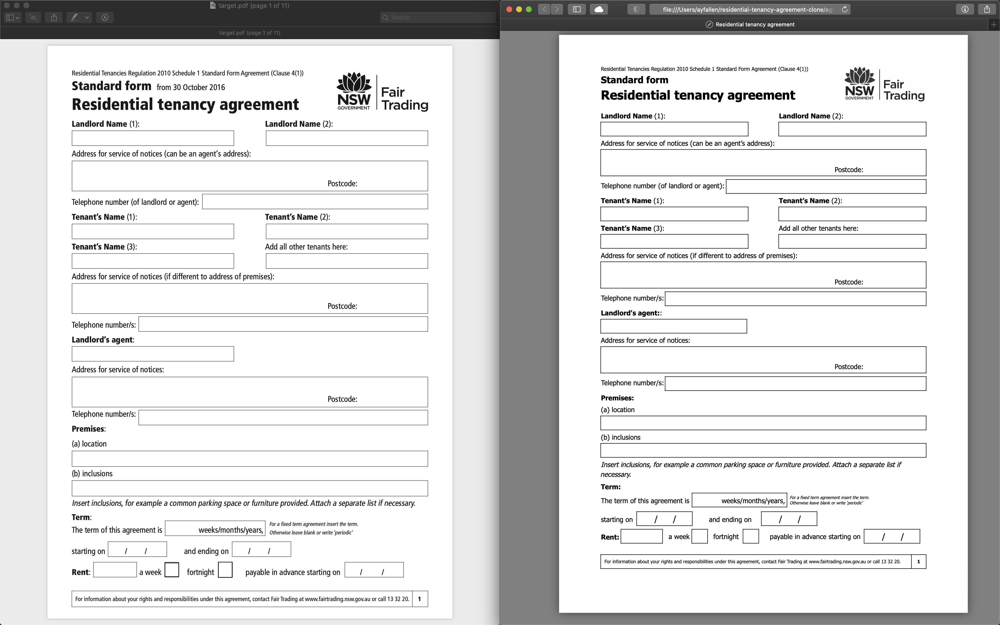

# residential-tenancy-agreement-clone

My journey on web development started with learning HTML and CSS (with flexbox).
Back then, I took a day to clone Residential tenancy agreement from Fair Trading NSW. 😵

The PDF document is at the left and my HTML page is at the right. 😀

